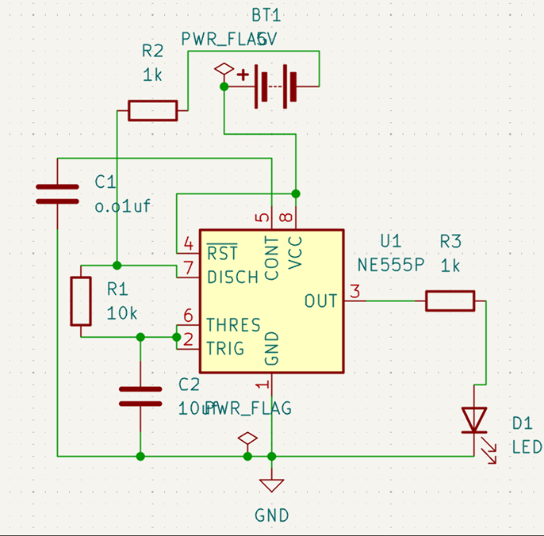
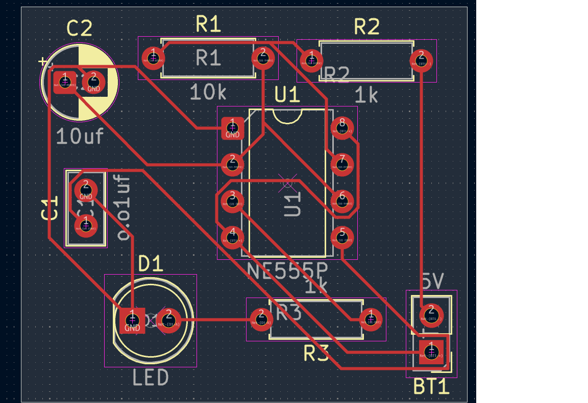
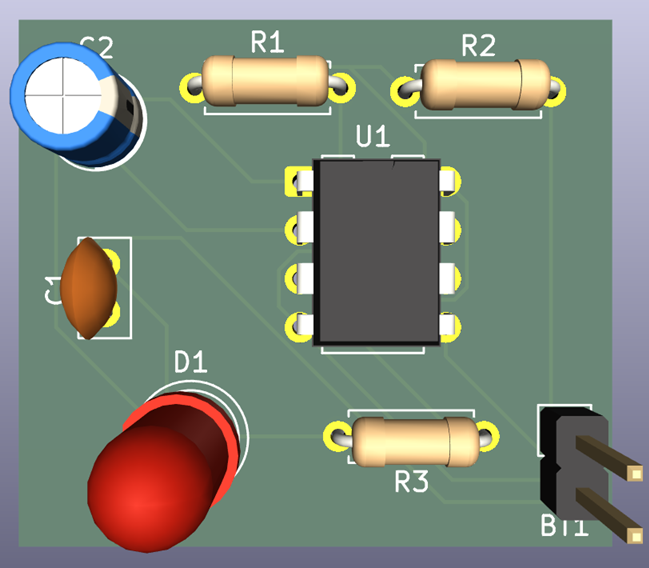

# NE555 LED Blinking Project

This project demonstrates a simple **LED blinking circuit** using the **NE555 timer IC**.  
The repository includes schematic, PCB layout, 2D & 3D images, and Gerber files for PCB manufacturing.

## Components Used
- NE555 Timer IC
- LED
- Resistors & Capacitors
- PCB layout designed in **KiCad**

## Schematic

## PCB Layout

## 3D View

## Gerber Files
The folder `LED_Blinking_Gerber_Final.zip` contains all manufacturing-ready Gerber files.

## How it Works
The NE555 timer is configured in **astable mode**, causing the LED to blink at a specific frequency.  
You can modify the resistors and capacitor values to change the blinking rate.
