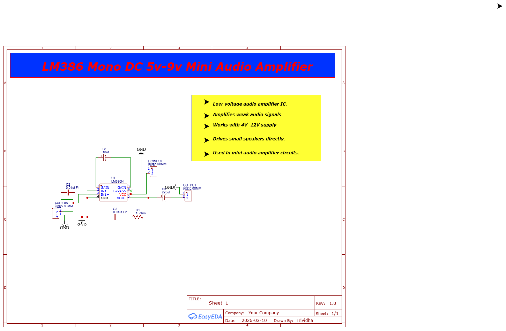
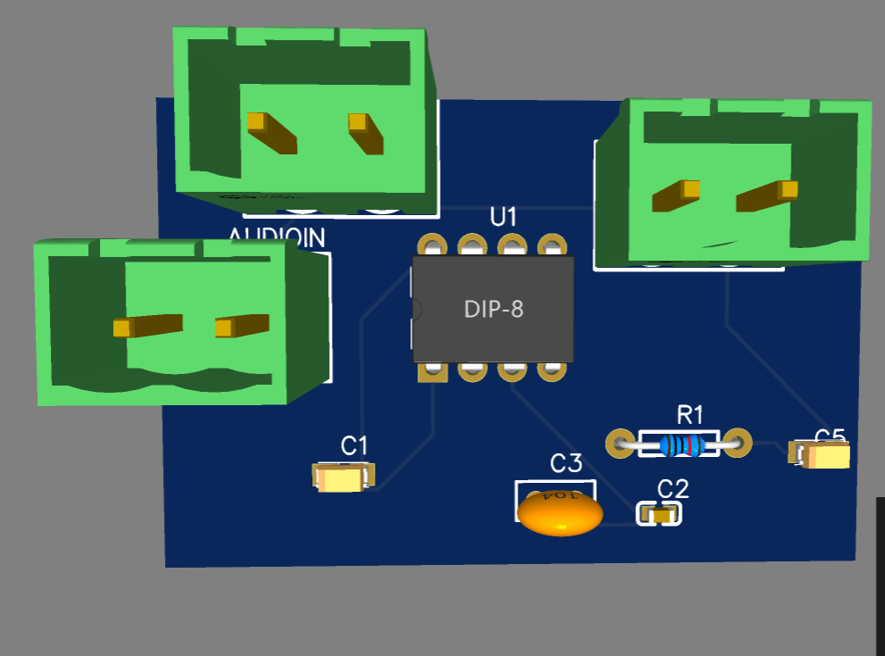
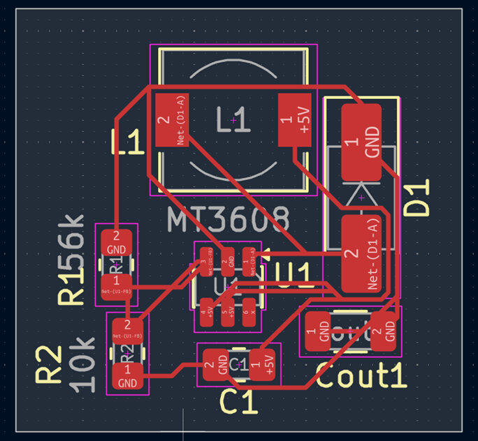
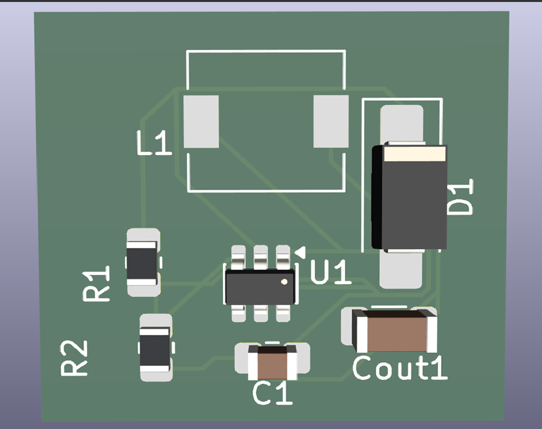

# ECE Projects

This repository contains my electronics and PCB design projects.

## Project 1: LM386 Audio Amplifier

**Description:**  
Designed a mini audio amplifier using LM386 IC to amplify weak audio signals.

**Software Used:**  
EasyEDA

**Components Used:**
- LM386 IC
- Capacitors
- Resistor
- Audio Input Connector
- Speaker Output Connector

## Circuit Schematic

## PCB 3D View

## Files Included
- Schematic_LM386-AMP-MONO.png
- LM386-PCB-3D.png
- LM386-AMP-MONO Circuit diagram .pdf
- SCH_LM386-AMP-MONO_2026-03-15.json
- Gerber_LM386-AMP-MONO_PCB_LM386-AMP-MONO_2_2026-03-10.zip

---

## Project 2: LED Blinking using NE555

### Description:

Designed an LED blinking circuit using NE555 timer IC in astable mode.

### 🔷 Circuit Schematic  

### 🔷 PCB Layout (2D)  

### 🔷 PCB 3D View  

### Features:

* Adjustable blinking speed
* Simple and beginner-friendly design

---

## Project 3: 5V to 10V Boost Converter using MT3608

### Description:

Designed a DC-DC boost converter PCB to step up 5V input to ~10V output using MT3608 IC.

### Software Used:

* KiCad

### Components Used:

* MT3608 IC
* Inductor
* Diode
* Capacitors
* Resistors

### Features:

* Compact PCB design
* Proper switching layout
* Stable output using feedback resistors

### Output:

* Input: 5V
* Output: ~10V

### Images:

---

## PCB 3D View

---
